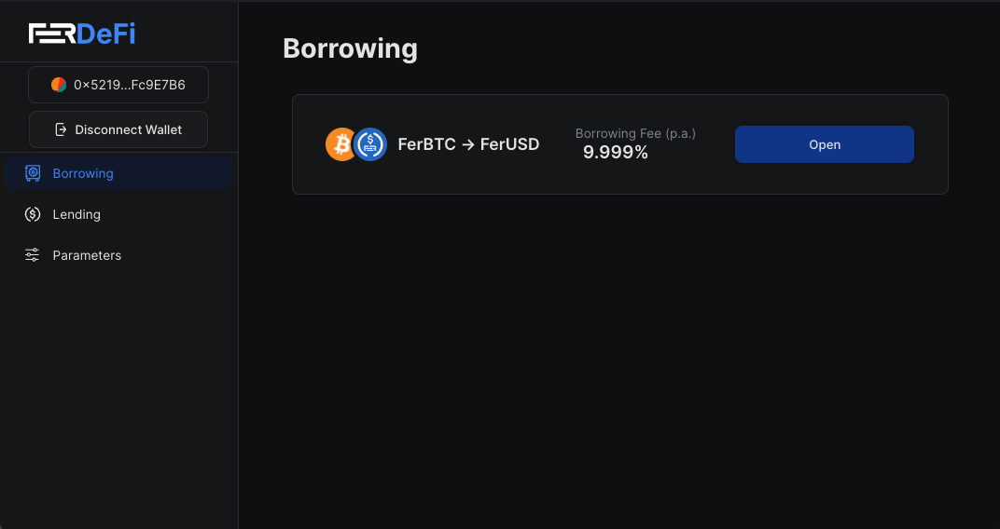
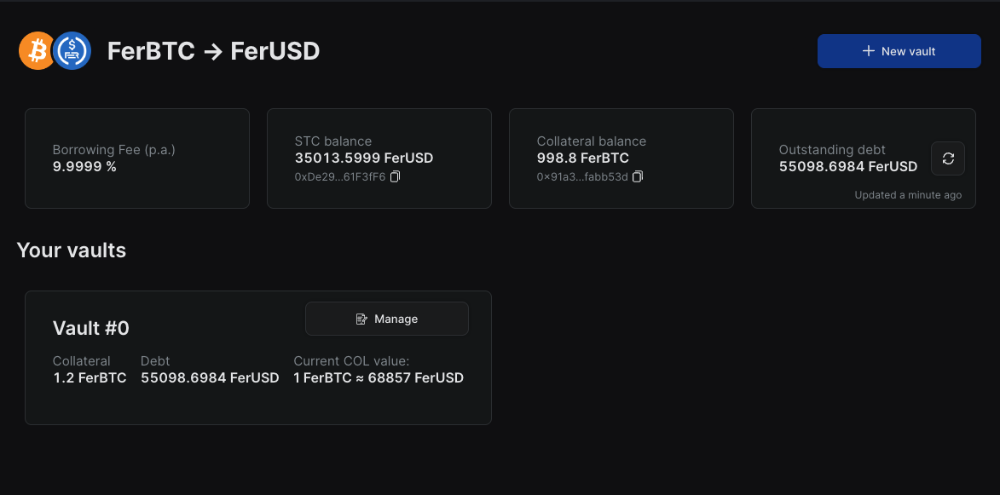
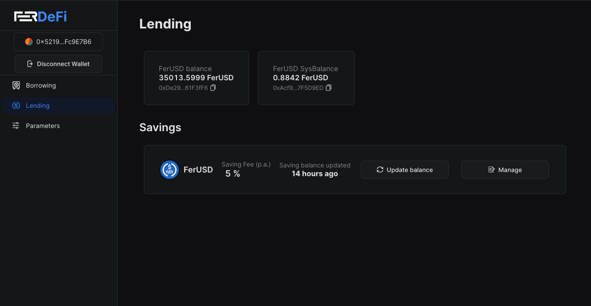
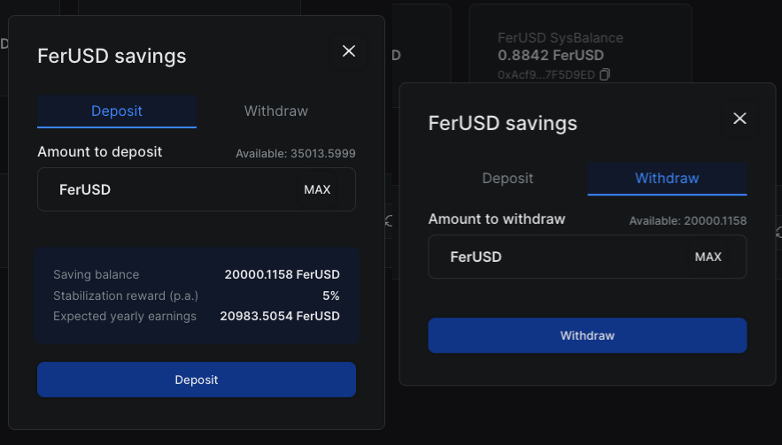
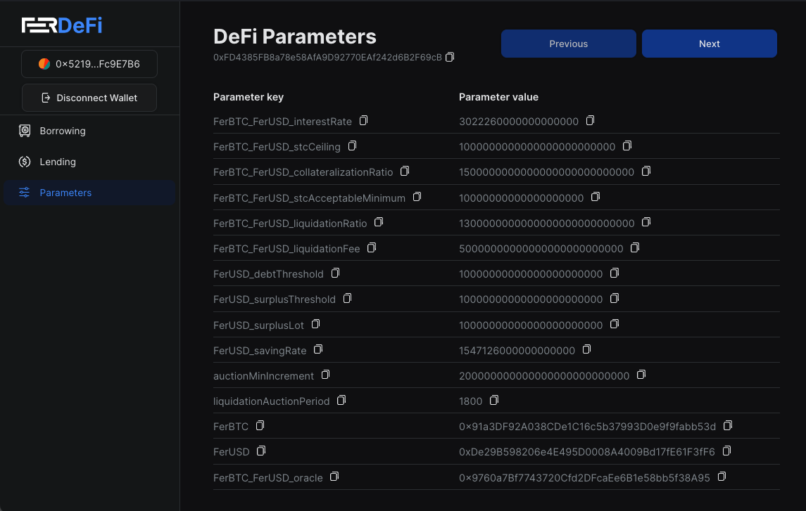

# Fer DeFi

### Description

This application integrates the implementation of MakerDAO to generate DAI tokens and enables borrowing and lending. 
Additionally, it includes aspects of Compound, particularly the normalization and denormalization of interest rates. 
The project is inspired by an existing implementation on the Q blockchain protocol. The smart contracts are written in 
Solidity, and the frontend is developed using React. This project was my Master's thesis, which I defended with the 
highest grade (5).

### App Screenshots

### Code
There are two main components to this project: the system contracts and the frontend DApp. The system contracts contain 
all the logic related to the blockchain and the overall system. The frontend DApp provides an interface for interacting 
with the smart contracts, enhancing the user experience.

More information about the project can be found in the README files for the system contracts and frontend DApp components.